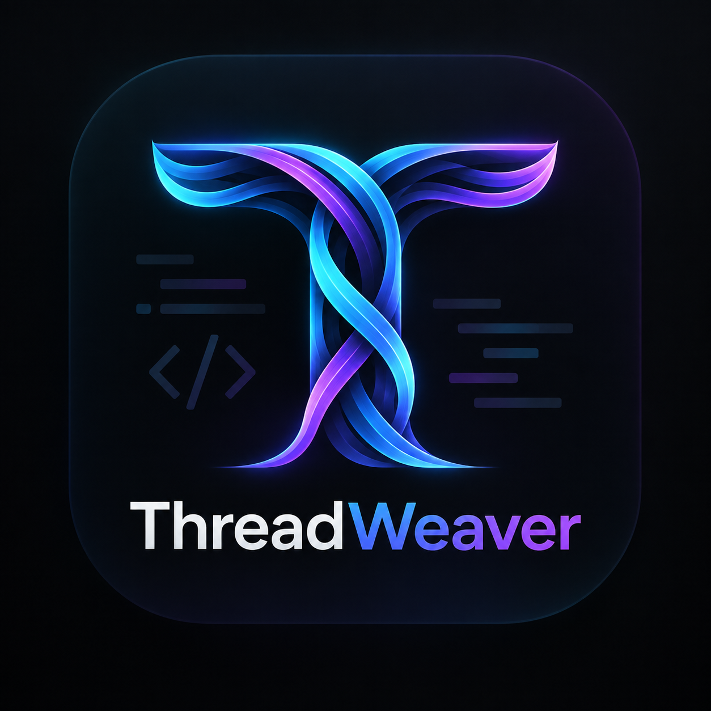

<div align="center">
  
  <h1>🧵 ThreadWeaver</h1>
  <p><strong>Antigravity Thread History, Artifact Manager, Context Size Monitor & Zip Backup Extension</strong></p>

  [](https://marketplace.visualstudio.com/items?itemName=tajinderdev.agy-threadweaver)
  [](https://open-vsx.org/extension/tajinderdev/agy-threadweaver)
  [](https://opensource.org/licenses/MIT)

</div>

**ThreadWeaver** is a sidebar extension for **Google Antigravity** (and compatible VS Code IDE environments) that provides real-time thread history tracking, context window size monitoring, artifact browsing, full `.zip` import/export backups, and smart context distillation to resume overloaded conversations in fresh threads.

---

## 🌟 Key Features

### 1. 🗂️ Left Sidebar Thread & Context Window Monitor
* **Thread Title & Categorization**: Shows thread titles extracted automatically from conversation goals or customized by you.
* **Real-time Context Window Load**:
  * Displays token estimates (e.g. `~18k tokens • 12 steps`) and byte footprint.
  * Visual context health badge:
    * 🟢 **Light** (< 35% threshold)
    * 🟡 **Moderate** (35% - 100% threshold)
    * 🔴 **Heavy / Overloaded** (> 100k tokens)
* **Artifact Explorer View**: Browse and open all markdown plans, diagrams, and scratch files generated across your threads with one click.

### 2. ⚡ Live Auto-Sync on Success
* Automatically tracks agent progress in real time.
* As soon as an agent turn finishes with a `DONE` (success) status, **ThreadWeaver** auto-syncs the latest snapshot and updates the context window metrics in your sidebar with zero manual effort.

### 3. 📦 Full Zip Export & Import
* **Export Thread as Zip**: Packages the complete thread into `<title>_<id>.zip` containing:
  * `thread_meta.json` (Thread ID, creation date, token stats, status)
  * `transcript.jsonl` & `logs/` (Full structured agent & user steps)
  * `conversation.md` (Human-readable markdown transcript with thinking summaries & tool calls)
  * `artifacts/` (All attached `.md` artifacts and scratch scripts)
* **Import Thread from Zip**: Select any exported `.zip` bundle to rehydrate and continue the conversation or inspect past artifacts.

### 4. 🚀 Context Distillation ("Weave into Fresh Thread")
* Avoid context window bloat or latency degradation.
* Generates a distilled briefing packet containing:
  * Initial goal & scope
  * Milestones achieved & code decisions made
  * Active artifacts & files modified
  * Direct reference link (`conversation://<thread-id>`)
* Copies the briefing directly to your clipboard and opens an editor preview, ready to paste into a brand-new clean Antigravity thread!

---

## 🚀 Installation

### Via Open VSX / VS Code Marketplace
1. Open the Extensions view (`Ctrl+Shift+X` or `Cmd+Shift+X`).
2. Search for **ThreadWeaver**.
3. Click **Install**.

### Manual Installation (VSIX)
1. Download the latest `.vsix` file from the [Releases](https://github.com/tajinderdev/agy-threadweaver/releases) page.
2. In VS Code, go to the Extensions view.
3. Click the `...` (More Actions) menu in the top right.
4. Select **Install from VSIX...** and choose the downloaded file.

---

## ⚙️ Extension Settings

| Setting | Default | Description |
|---|---|---|
| `threadweaver.brainPath` | `""` | Custom path to Antigravity brain directory (defaults to `~/.gemini/antigravity-cli/brain`). |
| `threadweaver.autoSyncOnSuccess` | `true` | Automatically sync and snapshot threads whenever the agent completes an action with success. |
| `threadweaver.contextLimitThreshold` | `100000` | Token count threshold considered high context load. |

---

## 🛠️ Development & Contributing

### Prerequisites
* [Node.js](https://nodejs.org/) (v18+)
* VS Code or Antigravity IDE

### Setup & Build
```bash
# Clone the repository
git clone https://github.com/tajinderdev/agy-threadweaver.git
cd agy-threadweaver

# Install dependencies
npm install

# Compile TypeScript
npm run compile

# Run automated tests
npm test

# Build bundled production extension
npm run build
```

### Running in Debug Mode (Extension Development Host)
1. Open this directory in Antigravity IDE / VS Code.
2. Press **`F5`** (or go to **Run & Debug** > select **"Run Extension (ThreadWeaver)"**).
3. A new Extension Development Host window will launch.
4. Click the **ThreadWeaver** icon in the Left Activity Bar to view all your threads and artifacts!

### Publishing
To package this extension into a `.vsix` bundle:
```bash
npm run package
```
To publish to Open VSX:
```bash
npx ovsx publish agy-threadweaver-0.1.0.vsix -p <your_token>
```

---

## 📄 License
This project is licensed under the MIT License. See the [LICENSE](LICENSE.txt) file for details.
